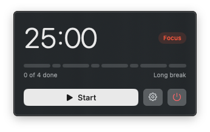
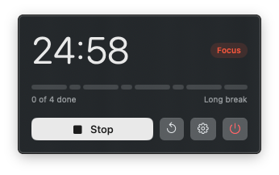
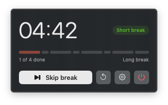
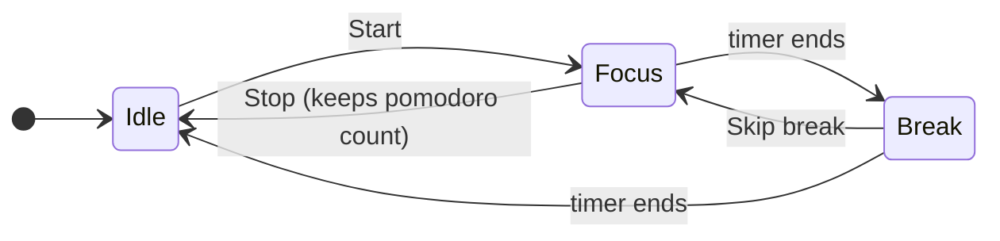

# Tomatea

A small macOS menu bar Pomodoro timer. It starts with 25-minute focus sessions,
5-minute short breaks, and a 15-minute break after every fourth focus session.
Session lengths can be changed from the timer's settings and are saved between
launches. Distinct bundled sounds play when you start the timer, when a focus
session ends, and when a break ends.

## How it works

Click the timer in the menu bar to open the controls. The big button always does
the next sensible step, and the small ↺ resets the cycle; it only shows once
there is progress to lose. Sessions can't be paused.

Idle — Start begins a focus session:



Focusing — Stop abandons this session but keeps your completed pomodoros:



On a break — Skip break starts the next focus session right away:





↺ from any state → Idle, 0 of 4 done.

When a focus session ends, the break starts automatically. When a break ends,
the next focus session waits for you to start it, unless you turn off
"Stop after break" in the settings, in which case it starts by itself.

### Global shortcut

Press ⇧⌘P from any app to do the same as the big button. The shortcut can be
changed in the settings; it must include ⌘, ⌃ or ⌥.

### Settings

Use the gear button to configure focus sessions (1–120 minutes), short breaks,
and long breaks (1–60 minutes each). Changes made while a session is running
apply to the next session. Use the power button (or ⌘Q while the controls are
open) to quit the app.

### macOS Focus

Turn on "Turn on Focus while focusing" in the settings (off by default) to switch
on a macOS Focus during focus sessions. macOS has no API for this, so create two
shortcuts in the Shortcuts app: "Tomatea Focus On" (Set Focus → turn on, until
turned off) and "Tomatea Focus Off" (Set Focus → turn off). Tomatea runs the first
when a focus session starts and the second when it ends, is stopped or reset, or you quit.

## Install

Requires macOS 13 or later and Xcode's Swift toolchain.

```sh
scripts/install.sh
```

Builds a release `Tomatea.app`, ad-hoc signs it, copies it to `/Applications`.
Re-run to update. To start it at login, turn on "Open at login" in the settings.

## Run in development

```sh
swift run
```

## Test

```sh
swift test
```
